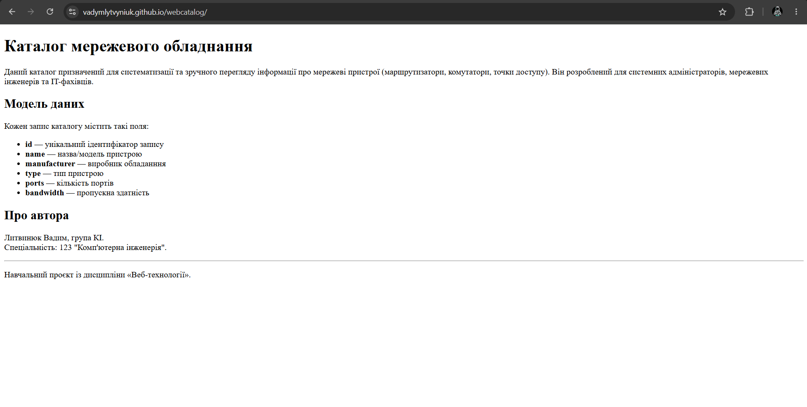
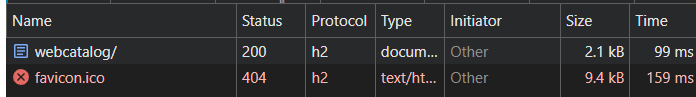

# Звіт з лабораторної роботи № 1

**Тема:** Створення репозиторію проєкту та публікація сайту в мережі
**Виконав(ла):** Литвинюк Вадим, група КІ
**Дата:** [20.09.2026]

---

## 1. Мета роботи

Створити та налаштувати локальний і віддалений Git-репозиторії, структурувати базові файли вебпроєкту, а також опанувати процес публікації статичного сайту в мережі Інтернет за допомогою сервісу GitHub Pages.

---

## 2. Обрана предметна область

**Тема каталогу:** Мережеве обладнання  
**Файл даних:** `data/network-devices.json`

**Обґрунтування вибору** Як студент спеціальності «Комп’ютерна інженерія», я вже кілька років вивчаю мережеві технології, тому дана тема є для мене зрозумілою та близькою. Обрана область дозволяє зручно структурувати характеристики комутаторів, маршрутизаторів, точок доступу та міжмережевих екранів, що ідеально підходить для реалізації динамічного каталогу з пошуком, фільтрацією та сортуванням. 

**Поля одного запису:**

| Поле | Тип | Опис | Роль у проєкті |
|---|---|---|---|
| `id` | рядок | ідентифікатор | ключ запису |
| `name` | рядок | назва/модель пристрою | заголовок картки товару|
| `vendor` | рядок | виробник обладанння | фільтрація за виробником |
| `category` | рядок | категорія пристрою | категоризація та фільтрація |
| `year` | число | рік виробництва | сортування, фільтр за діапазоном |
| `ports` | число | кількість портів | фільтр та технічна характеристика |
| `throughput` | число | пропускна здатність | фільтрація за швидкістю |
| `poe` | булеве | підтримка живлення через Ethernet | фільтрація пристроїв |
| `price` | число | ціна пристрою | сортування за ціною |
| `tags` | масив рядків | набір характеристик пристрою | пошук за кількома ознаками |
| `description` | рядок | текстовий опис пристрою | текст на сторінці деталей |
| `image` | рядок | зображення пристрою | шлях до зображення |
| `featured` | булеве | ознака відображення пристрою як рекомендованого | ознака «рекомендоване» |

---

## 3. Структура проєкту

```
webcatalog/
├── index.html          головна сторінка
├── css/                стилі
├── js/                 скрипти
├── img/                зображення
├── data/               набори даних у форматі JSON
├── docs/               звіти з лабораторних робіт
└── README.md           опис проєкту
```

---

## 4. Результати

**Адреса опублікованого сайту:** https://vadymlytvyniuk.github.io/webcatalog/

**Скріншот 1.** Сторінка, відкрита за опублікованою адресою.



**Скріншот 2.** Вкладка Network із запитом власної сторінки: видно код стану й протокол.



**Кількість комітів на момент здачі:** 8

---

## 5. Труднощі та їх усунення

| Що не вийшло | У чому була причина | Як розв'язано |
|---|---|---|
| | | |
| | | |

Під час виконання роботи жодних проблем не виникало.

---

## 6. Відповіді на контрольні запитання

**1. Що станеться, якщо перейменувати `index.html` на `main.html`?**

За замовчуванням веб-сервер шукає index.html як головну сторінку. Якщо перейменувати його, при відкритті сайту може з’явитися помилка 404. Щоб відкрити сторінку, потрібно буде вказати шлях до нового файлу.

**2. Чим `commit` відрізняється від `push`?**

git commit зберігає зміни в локальному репозиторії на комп'ютері. git push відправляє закомічені зміни на GitHub. Якщо виконати тільки commit, зміни залишаться на комп'ютері, але ніхто інший (і віддалений сервер, зокрема GitHub Pages) їх не побачить.

**3. Чому зображення можуть не відображатися після публікації, хоча локально все працює?**

Можливі причини:  
•	Неправильно вказаний шлях до зображення, наприклад використовується шлях від кореня локальної системи замість відносного.  
•	Назва файлу або папки відрізняється за регістром літер (Img і img), що особливо важливо для GitHub Pages.

---

## 7. Висновок

У ході лабораторної роботи було створено репозиторій на GitHub та підготовлено базову структуру вебкаталогу «Мережеве обладнання». Було освоєно роботу з Git, виконання комітів і push, а також створено стартову HTML-сторінку та перевірено її роботу через Live Server. Сайт було опубліковано за допомогою GitHub Pages і перевірено його доступність на різних пристроях. Також було перевірено оновлення сторінки після внесення та відправлення змін до репозиторію.

---

## 8. Використані джерела

[Методичні вказівки до виконання лабораторної роботи](https://classroom.google.com/u/0/c/ODc3NjQwNTAyMzI2/a/ODg0MTM5NjUwNjEw/details)  
[Стартовий репозиторій для виконання роботи наданий викладачем](https://github.com/severyn-courses/webcatalog)
