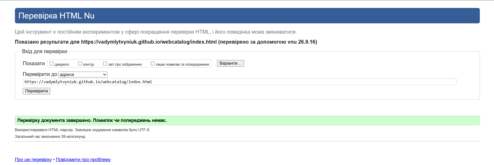
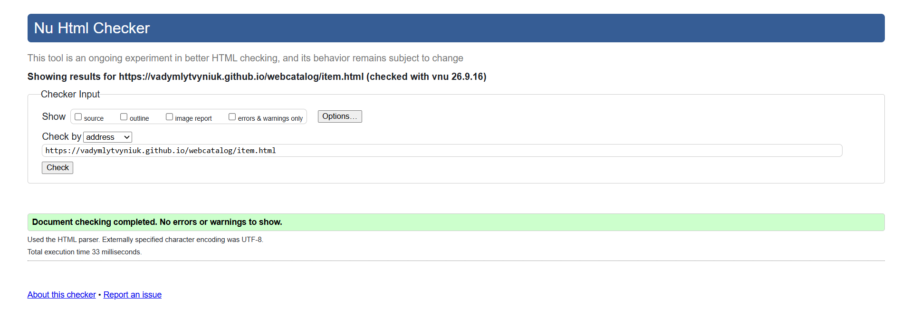
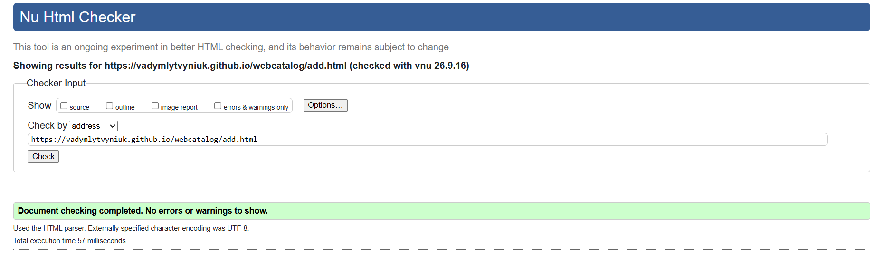
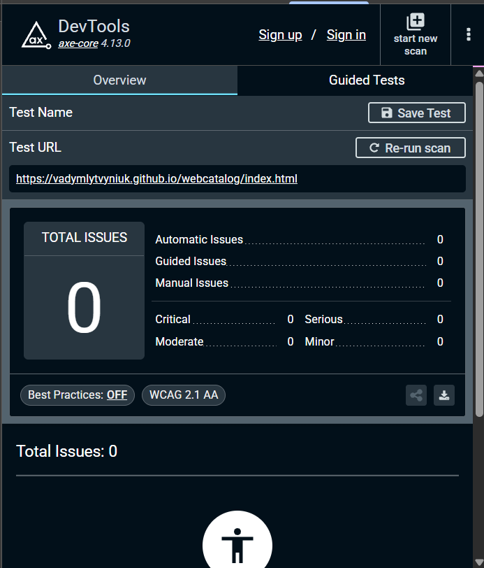
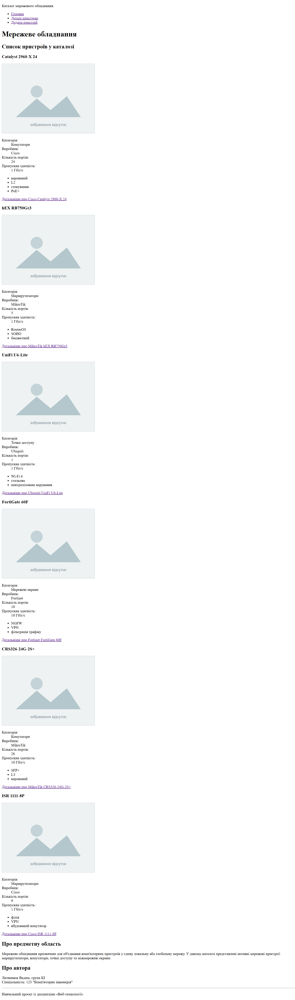

# Звіт з лабораторної роботи № 2

**Тема:** Семантична розмітка сторінок каталогу  
**Виконав(ла):** Литвинюк Вадим, група КІ  
**Дата:** [27.09.2026]

---

## 1. Мета роботи

Створити початкову HTML-структуру каталогу з трьох сторінок із використанням семантичної розмітки, таблиці та форми.

---

## 2. Обґрунтування структури

article обрано для оформлення кожного окремого пристрою каталогу як самостійного запису зі своїми характеристиками.

section обрано для логічного об’єднання пов’язаного вмісту сторінки (Наприклад, списку пристроїв у каталозі, інформації про пристрій та форми нового запису). 

aside обрано для розміщення загальної інформації про мережеве обладнання, як допоміжного тексту для основного вмісту сторінки. 

---

## 3. Результати

**Адреса опублікованого сайту:** https://vadymlytvyniuk.github.io/webcatalog/

**Скріншоти 1-3.** Результати валідації всіх трьох сторінок.

**Скріншот 4.** Звіт axe DevTools.

**Скріншот 5.** Головна сторінка каталогу.

**Опис маршруту клавіатурою:**  
Для переходу від початку сторінки до першого посилання каталогу (картки пристрою Catalyst 2960-X 24) знадобилося 4 натискання клавіші Tab.

---

## 4. Труднощі та їх усунення

| Що не вийшло | У чому була причина | Як розв'язано |
|---|---|---|
| | | |
| | | |

Під час виконання роботи жодних проблем не виникало.

---

## 5. Висновок

У ході лабораторної роботи було створено наскрізний HTML-проєкт із трьох семантично структурованих сторінок: головної, сторінки деталей пристрою та форми додавання. Реалізовано навігацію між сторінками, доступність з клавіатури та вбудовану перевірку даних форми. Усі три сторінки пройшли перевірку валідності HTML-коду та відповідають вимогам щодо структури й доступності.

---

## 6. Використані джерела

[Методичні вказівки до виконання лабораторної роботи](https://classroom.google.com/u/0/c/ODc3NjQwNTAyMzI2/a/ODg1NTI4ODE1OTU0/details)  
[Стартовий репозиторій для виконання роботи наданий викладачем](https://github.com/severyn-courses/webcatalog)  
ChatGPT (OpenAI)